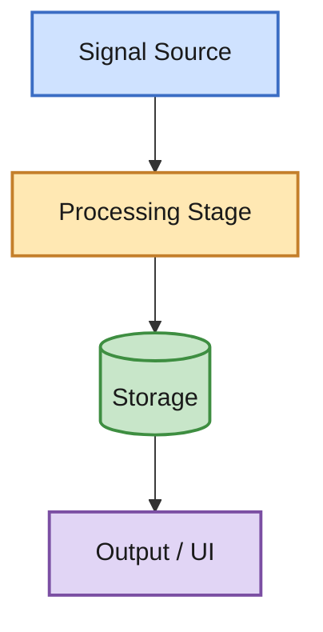
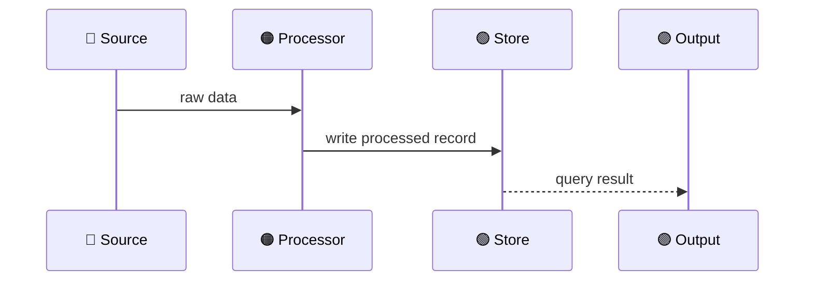
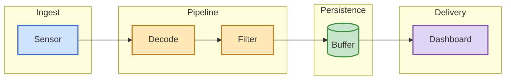
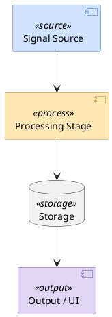

# Mermaid Style Guide — Role-Based Color System

Color in diagrams is **semantic, not decorative**. Every box's color must match the `role` in its component
note's frontmatter. This lets a reader learn the color code once and then scan any diagram in the vault without
re-reading labels.

## The four roles

| Role | Meaning | Color family | Hex (fill) | Hex (stroke) |
|---|---|---|---|---|
| **Source** | Where data/signal originates (sensors, APIs, user input, RF frontend) | Blue | `#cfe2ff` | `#3b6dc4` |
| **Process** | Transformation, compute, business logic | Amber/Orange | `#ffe8b3` | `#c47f2b` |
| **Storage** | Persistence — DBs, buffers, queues, filesystems | Green | `#c8e6c9` | `#3e8e41` |
| **Output** | Sinks — UI, external delivery, actuators, exports | Purple | `#e1d5f5` | `#7b4fa3` |

These are deliberately soft/pastel fills with a saturated stroke — readable in both Obsidian's light and dark
theme, since Mermaid diagrams in Obsidian inherit the app's current theme background.

## Standard classDef block (copy-paste into every diagram)

Apply the `:::role` suffix to every node. Don't leave nodes unstyled — an unstyled node reads as "uncategorized"
which usually means the role wasn't decided, which is itself worth flagging rather than skipping.

## Sequence diagrams

`sequenceDiagram` doesn't support `classDef` on participants the same way. Use consistent **emoji or label
prefixes** instead to preserve the role signal:

## Flowcharts with subgraphs (for grouping components by stage)

## When to fall back to PlantUML

Only when Mermaid genuinely can't express the diagram well:
- Detailed **deployment diagrams** with `<<stereotype>>` annotations and nested nodes
- **Component diagrams** with interface lollipops/sockets
- Diagrams needing precise **multiplicities** (`1..*`, `0..1`) on associations

For PlantUML, use `skinparam` to mirror the same four-color role system:

State explicitly in the note when PlantUML is used instead of Mermaid, and why (e.g. "PlantUML used here for
stereotype annotations Mermaid doesn't support").

## Obsidian rendering notes

- Obsidian renders Mermaid natively in both edit-preview and reading view — no plugin required for the diagrams
  above.
- PlantUML is **not** rendered natively; it needs a community plugin (e.g. "PlantUML"). If a PlantUML diagram is
  used, say so in the note text so the user knows to install the plugin or view it externally.
- Keep one diagram per code fence — don't concatenate multiple `graph` blocks in one fence, Mermaid only renders
  the first.
